<!-- ============================================================
     PORTADA — una sola por documento.
     cover-title: título principal · artist-name: nombre · url: enlace al sitio
     ============================================================ -->
::: {.cover style="background-image: url('./images/lamemoria4.png')"}

[Trabajo seleccionado]{.cover-subtitle}

# Portafolio {.cover-title}

::: {.cover-meta}
[Matías Serrano Acevedo]{.artist-name}

[https://misaa.cc](https://misaa.cc){.url}
:::
:::

<!-- ============================================================
     BIOGRAFÍA — una sola por documento.
     Admite hasta 3 párrafos dentro de .bio-body.
     ============================================================ -->
::: {.bio}
## Biografía

::: {.bio-body}
Matías Serrano Acevedo (Santiago, 1993) es artista sonoro y electrónico. Magíster en Artes Mediales (2024) y Licenciado en Artes mención Sonido (2017), ambos de la Universidad de Chile. Becario desde 2026 del programa de Doctorado en Artes y Humanidades de la Universidad de Santiago de Chile. 

Académico adjunto y parte del Núcleo de Artes Sonoras del Departamento de Artes Visuales de la U. de Chile. Ha presentado su trabajo en diversos espacios, exposiciones y festivales en Chile y latinoamérica y ha publicado varios álbumes bajo el pseudónimo de “misaa”. Desde 2022 se desempeña como docente de arte, electrónica y medios en carreras de artes visuales en UNIACC, UDP y U. de Chile. Creó la Colectiva 22bits en 2015 y el sello Archivo Veintidós en 2019 junto a Bárbara Molina, a través de los cuales participaron de encuentros y festivales de arte, tecnología, sonido y diseño en Chile, México, Argentina y Colombia.
:::

:::

<!-- ============================================================
     STATEMENT — una sola por documento.
     Para omitir la imagen vertical, elimina el bloque .statement-image.
     statement-body admite varios párrafos.
     ============================================================ -->
::: {.statement}
::: {.statement-left}
## 

::: {.statement-image}

:::
:::

::: {.statement-body}
Mi práctica está orientada a relacionar lo sonoro y lo material, vinculando técnicas de fabricación electrónica, hackeo y ensamblaje de objetos con prácticas de escucha situada y registros de campo. Inspirado en filosofías cosmológicas, concibo al arte sonoro como una exploración de los flujos y fuerzas en la naturaleza que se manifiestan en interacciones materiales, articuladas desde la escucha.

[“Estamos inmersos en [el ruido] hasta el cuello, hasta los ojos y hasta la coronilla, en un océano furioso, iracundo; mejor aún, somos de parte a parte la voz de este huracán, ese bramido térmico, y no sabemos nada de ello.” — Michel Serres]{.statement-quote}
:::
:::

<!-- ============================================================
     PROYECTO — copiar este bloque completo para cada obra.
     Usa {.project} para imagen a la izquierda (por defecto)
     Usa {.project .project-right} para imagen a la derecha
     · project-number: número de fondo (01, 02…)
     · h2: título de la obra
     · project-subtitle: Instalación / Concierto / Residencia / …
     · project-materials: circuitos, parlantes, micrófonos, pintura… (opcional)
     · párrafo de descripción
     · enlace: "[Técnica / Año — Ver proyecto →](url)"
     Alt de la imagen: aparece como crédito fotográfico superpuesto.
     ============================================================ -->
::: {.project}
::: {.project-image}

:::

::: {.project-text}
[Galería Metropolitana. Santiago, Chile]{.project-location}

## Llluvia Metropolitana (2026)

[Instalación + Rainer Krause]{.project-subtitle}
[Andamio intervenido, 5 parlantes, archivo de audio de 5 canales, 4 dibujos de acuarela y tinta china sobre papel, 3 circuitos electrónicos generadores de ruido de lluvia]{.project-materials}

"_Llluvia Metropolitana_ emerge alrededor de una premisa sonora que intenciona la experiencia sensible con el clima. Los artistas instalaron un sistema de grabación en los techos de zinc de la galería durante el período de lluvias invernales. Parte de este registro se nos presenta desde una altura a la que podemos acceder cuando subimos por un andamio reforzado. Se propone entonces un encuentro entre una lluvia anterior, o quizás una lluvia en pausa, que frente a la sensación atmosférica calurosa y seca, propia de enero en la ciudad, propone a lo menos una disonancia." — Extracto de texto por Catalina Montero

[Documentación completa y video](https://misaa.cc/projects/llluviametropolitana.html)
:::
:::

::: {.project}
::: {.project-image}

:::

::: {.project-text}
[Galería Metropolitana. Santiago, Chile]{.project-location}

## Llluvia Metropolitana (2026)

[Instalación + Rainer Krause]{.project-subtitle}
<!-- [Circuitos electrónicos, micrófonos, parlantes, madera, andamio]{.project-materials} -->

El proyecto expositivo consiste en una sola gran obra ensamblada a partir de elementos co-construidos entre Rainer y Matías, y de ejercicios realizados de manera independiente. El eje de la muestra es el sonido de la lluvia, que fue grabada por medio de un sistema de 4 micrófonos instalados cerca del techo de zinc del espacio durante los meses de junio, julio y agosto de 2025, que registraban en un computador controlado de manera remota el sonido de cada evento de lluvia. En total, se registraron alrededor de 164 GB de audio, lo que equivale a unas 126 horas de audio a 4 canales, aproximadamente. Estos fueron editados y mezclado en una banda sonora de 4 horas, que se reproduce en la sala durante el horario de apertura de la galería. 

[Documentación completa y video](https://misaa.cc/projects/llluviametropolitana.html)
:::
:::

<!-- INICIO PROYECTO DERECHO -->
<!-- INICIO PROYECTO DERECHO -->
<!-- INICIO PROYECTO DERECHO -->

::: {.project .project-right }
::: {.project-image}
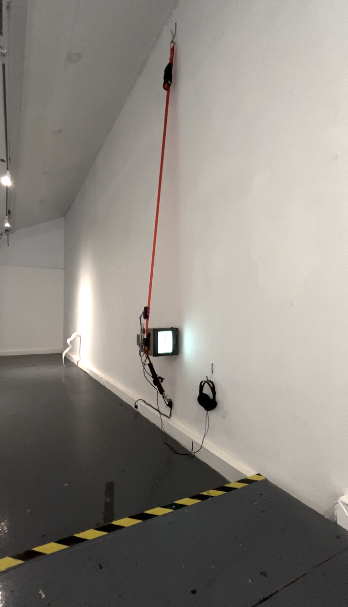
:::

::: {.project-text}
[Galería Artes Visuales UNIACC. Santiago, Chile]{.project-location}

## Cuando todas las palabras sean borradas (2025)

[EXPOSICIÓN A DÚO + ALMENDRA DÍAZ]{.project-subtitle}
[
     _oí 1_. Instalación Ladrillo de concreto, piola de acero, motor paso a paso unipolar, piedra de canto rodado, microcontrolador atmega328p 
]{.project-materials}

[
     _oí 2_. Instalación. Monitor Sony PVM-8020, eslinga de amarre, Raspberry Pi 4, audio en estéreo e imagen generativa en p5.js, audífonos 
]{.project-materials}

[
     _oí 3_. Ensamblaje. Frasco de vidrio, bolitas transparentes, pieza de tercera mano, motor de microondas, cordón eléctrico, gancho de acero 
]{.project-materials}

"El adjetivo no implica carencia de valor, sino una voluntad de situarse fuera del régimen del significado: objetos que no devienen signo, que no aspiran a construir sentido. Se trata de una propuesta material que explora la contingencia de los materiales, en tanto estados puntuales de una materia afectada por fuerzas externas. Son, quizás, el sustrato actual para metáforas futuras. Objetos sin función, sin intención comunicativa, sin correlación con un sujeto: fragmentos de materia que solo dan cuenta de los flujos energéticos que los han atravesado, y que no buscan ser leídos, sino simplemente estar." — Extracto de texto curatorial

[Documentación completa](https://misaa.cc/projects/cuandotodaslaspalabras.html)
:::
:::

<!-- FIN PROYECTO DERECHO -->
<!-- FIN PROYECTO DERECHO -->
<!-- FIN PROYECTO DERECHO -->

<!-- ============================================================
     PÁGINA IMAGEN COMPLETA 
     ============================================================ -->
::: {.fullpage}
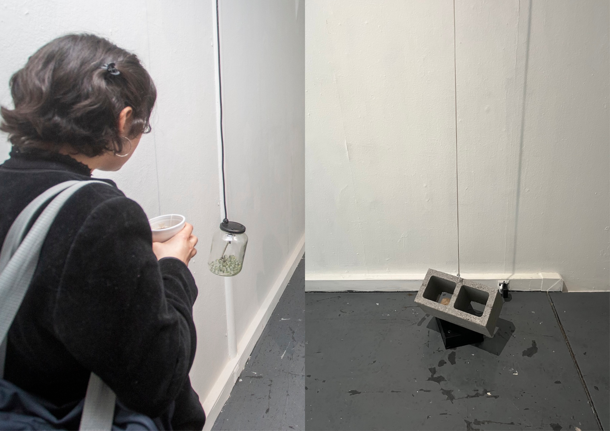
:::

<!-- FIN IMAGEN COMPLETA -->

<!-- INICIO PROYECTO DERECHO -->
<!-- INICIO PROYECTO DERECHO -->
<!-- INICIO PROYECTO DERECHO -->

::: {.project .project-right .caption-dark}
::: {.project-image}

:::

::: {.project-text}
[Museo MAC Quinta Normal. Santiago, Chile]{.project-location}

## Transistores en tránsito (2025)

[INSTALACIÓN]{.project-subtitle}
[10 placas electrónicas con circuito de compuertas NAND y driver, 10 bobinas de baja impedancia, 10 imanes, alambre esmaltado. 120 x 270 cm
]{.project-materials}

Parte de la exposición “Tiempo de Decaimiento Temprano” del Núcleo de Artes Sonoras en Museo MAC de Quinta Normal.

"El concepto de “nube” en la tecnología electrónica opera como una metáfora que propone un desacoplamiento de los dispositivos con la tierra. Sin embargo, ese lenguaje parece olvidar que toda tecnología tiene un origen en el suelo. El silicio, materia prima de los transistores y procesadores, es el segundo material más abundante en la tierra. El cobre conduce y conecta la geopolítica global, como sugiere Ingrid Wildi. El plástico proviene de milenarios combustibles fósiles. Según Jussi Parikka, estos elementos en su uso se degradan a sí mismos, retornando a su condición de “polvo”. En el trayecto, por medio de diversas energías, se mueven, transforman y relacionan." — Extracto cédula

[Documentación completa y video](https://misaa.cc/projects/transistoresentransito.html)
:::
:::

<!-- FIN PROYECTO DERECHO -->
<!-- FIN PROYECTO DERECHO -->
<!-- FIN PROYECTO DERECHO -->

<!-- INICIO PROYECTO -->
<!-- INICIO PROYECTO -->
<!-- INICIO PROYECTO -->

::: {.project}
::: {.project-image .caption-dark}
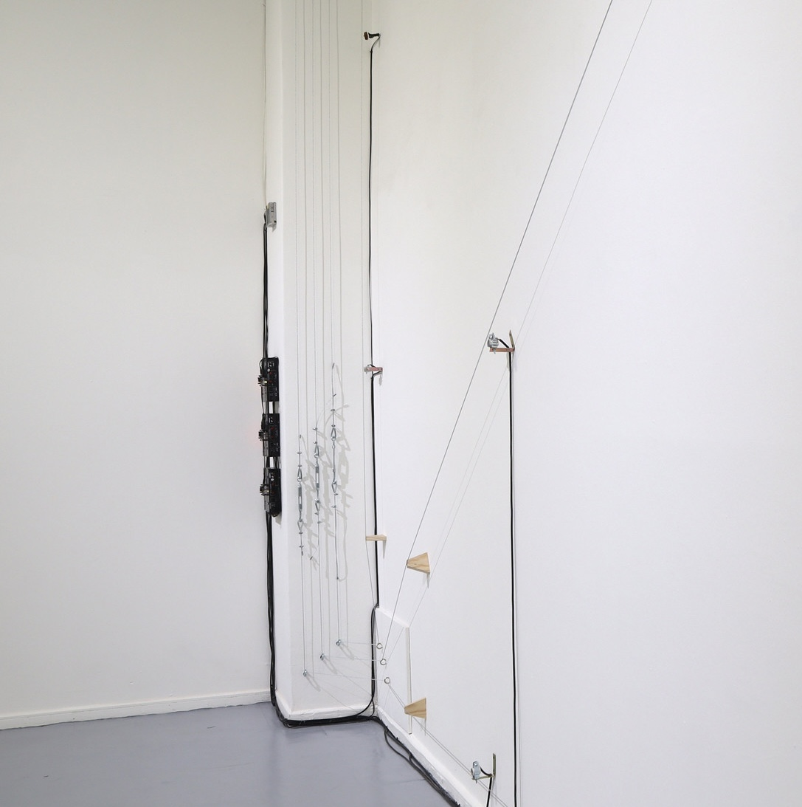
:::

::: {.project-text}
[Museo MAC Quinta Normal. Santiago, Chile]{.project-location}

## Un trazo en el oído (2025)

[INSTALACIÓN]{.project-subtitle}
[3 piolas de acero, 3 bobinas de alta impedancia, 3 bobinas de baja impedancia, 6 imanes de neodimio, tensores, 3 amplificadores de audio, 3 placas electrónicas con circuito astable 700 x 350 x 50 cm]{.project-materials}

Parte de la exposición “Tiempo de Decaimiento Temprano” del Núcleo de Artes Sonoras en Museo MAC de Quinta Normal.

"La obra plantea que el acto de trazar/tejer comienza en la extrañeza que representan los fenómenos acústicos, a los que accedemos desde antes de nacer. Por medio de materiales industriales se activa electromagnéticamente una pared para que resuene y amplifique su plasticidad inherente." — Extracto cédula  

[Documentación completa y video](https://misaa.cc/projects/untrazoeneloido.html)
:::
:::

<!-- FIN PROYECTO -->
<!-- FIN PROYECTO -->
<!-- FIN PROYECTO -->

<!-- ============================================================
     PÁGINA IMAGEN COMPLETA — copiar este bloque para cada imagen a pantalla completa.
     El texto del alt ![...] aparece como crédito fotográfico
     superpuesto en la esquina inferior derecha.
     ============================================================ -->
::: {.fullpage}
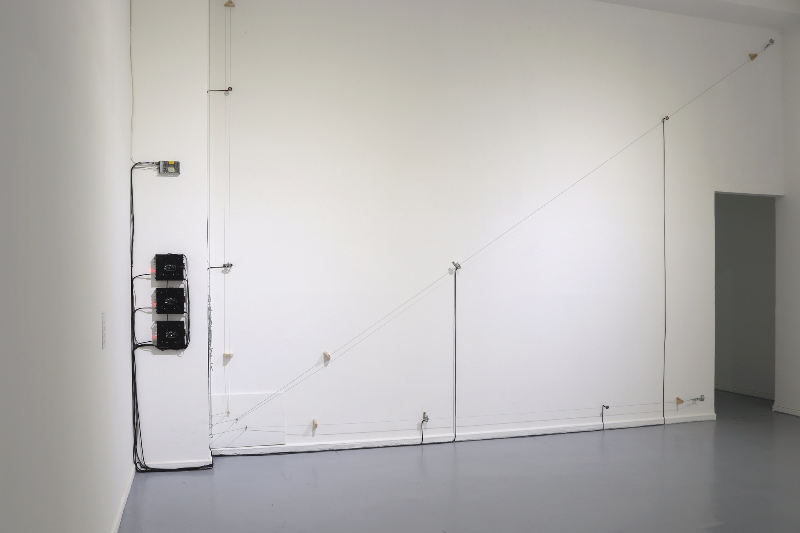
:::

<!-- FIN IMAGEN COMPLETA -->

<!-- INICIO PROYECTO -->
<!-- INICIO PROYECTO -->
<!-- INICIO PROYECTO -->

::: {.project}
::: {.project-image}
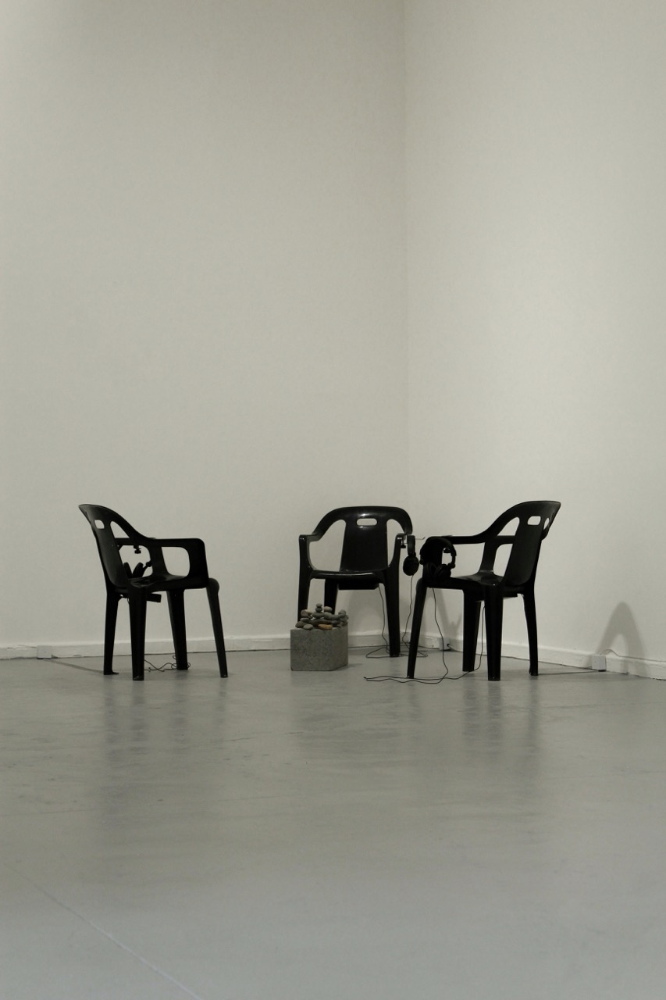
:::

::: {.project-text}
[Museo MAC Quinta Normal. Santiago, Chile]{.project-location}

## Lenguaje y comunicación (2024)

[INSTALACIÓN]{.project-subtitle}
[3 sillas de plástico negras, 3 audífonos, 3 reproductores de audio, ladrillo de concreto, piedras de río, archivo de audio en mp3 de 28 minutos dividido en 3 partes. Parte de la exposición colectiva Balmaceda Visual: Bordes Fluidos en Museo de Arte Contemporáneo de Quinta Normal. 2024. ]{.project-materials}

 La obra propone una lectura en torno a la comunicación y los gestos que la constituyen. Mediante la amplificación de los espacios negativos de una conversación, como los titubeos, silencios, muletillas y respiraciones, se busca retorcer los conceptos de emisor, receptor y mensaje. La obra sitúa a quien experiencia la obra en medio de un extenso diálogo que parece no llevar a ninguna parte, en el que la conversación de dos personas es editada de forma en que se deja oír solo el ruido entre palabras. La experiencia de la obra se completa al sentarse en una de las tres sillas, alrededor de un ladrillo de concreto que contiene piedras ovaladas, generando una puesta en escena -paradójicamente- tan extraña como habitual. 
 
[Documentación completa](https://misaa.cc/projects/lenguajeycomunicacion.html)
:::
:::

<!-- FIN PROYECTO -->
<!-- FIN PROYECTO -->
<!-- FIN PROYECTO -->

<!-- INICIO PROYECTO -->
<!-- INICIO PROYECTO -->
<!-- INICIO PROYECTO -->

::: {.project}
::: {.project-image}
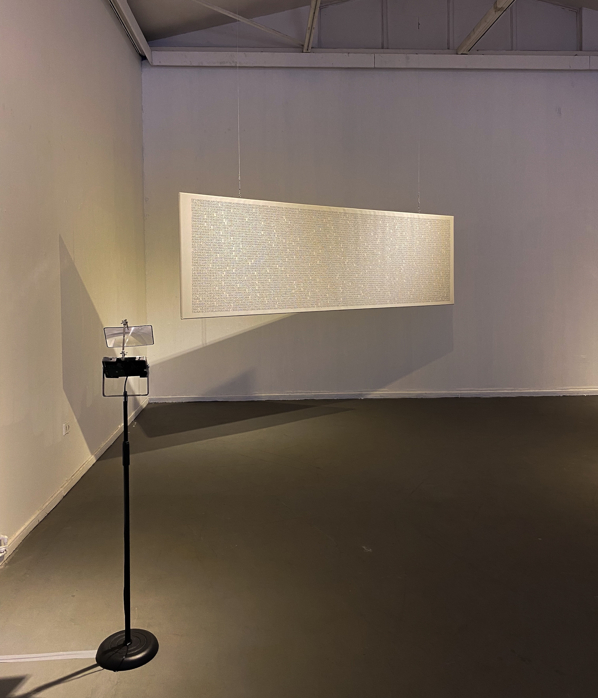
:::

::: {.project-text}
[Sala Juan Egenau. Santiago, Chile]{.project-location}

## Amplificar la duda (2024)

[PROYECTO EXPOSITIVO]{.project-subtitle}
[7 ensamblajes basados en reproductores de audio, discos duros, atriles de micrófono y lupas. Piedras de canto rodado e impresión en canvas.]{.project-materials}

 "Inspirado" por el trabajo audiovisual de Amel Baggs en In my language (2007) y de los dibujos de los movimientos cotidianos de niños autistas realizados por Fernand Deligny, me propuse retroceder a los gestos y rasgos que los diagnósticos psiquiátricos ligados al espectro autista buscan envolver, sugiriendo el concepto de “sensibilidad extraña”. Desde esta idea, generé instancias de escucha donde dialogué con personas adultas que, independiente de si contaban o no con un diagnóstico, me comentaron sus historias, dudas, rasgos y comportamientos que podrían ser calificados como extraños. A través de la exposición, reflexiono en torno a las percepciones, rasgos y gestos extraños, especulando sobre los límites y categorías de lo que significa ser una persona." — Extracto de texto muro 
 
[Documentación completa y video](https://misaa.cc/projects/amplificarladuda.html)
:::
:::

<!-- FIN PROYECTO -->
<!-- FIN PROYECTO -->
<!-- FIN PROYECTO -->

<!-- ============================================================
     PÁGINA IMAGEN COMPLETA — copiar este bloque para cada imagen a pantalla completa.
     El texto del alt ![...] aparece como crédito fotográfico
     superpuesto en la esquina inferior derecha.
     ============================================================ -->
::: {.fullpage .caption-dark}
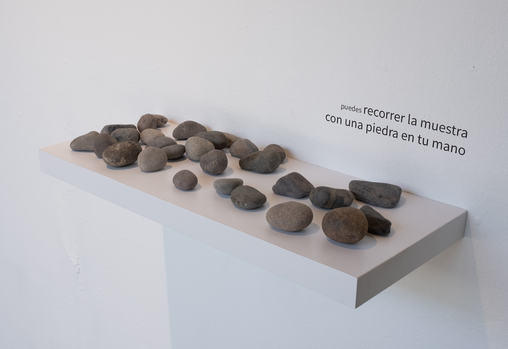
:::

<!-- FIN IMAGEN COMPLETA -->

<!-- INICIO PROYECTO DERECHO -->
<!-- INICIO PROYECTO DERECHO -->
<!-- INICIO PROYECTO DERECHO -->

::: {.project .project-right .caption-dark}
::: {.project-image}
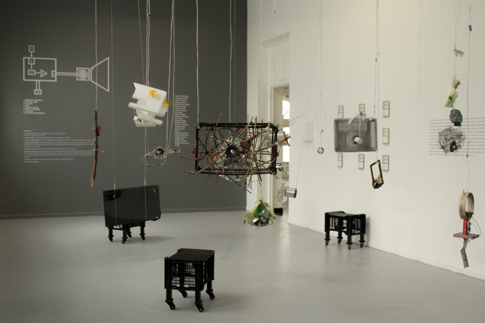
:::

::: {.project-text}
[Museo MAC Quinta Normal. Santiago, Chile]{.project-location}

## Museo en estéreo (2024)

[INSTALACIÓN SONORA]{.project-subtitle}
[Desarrollada en laboratorio de Sonido y Objeto en conjunto con la Unidad de Educación del Museo de Arte Contemporáneo, María Ignacia Valdebenito y vecinxs y transeúntes de las dos sedes del Museo de Arte Contemporáneo 
]{.project-materials}

"Se trata entonces de una inmersión en la geografía que se traduce en archivos sonoros y que, tras una nueva vuelta de tuerca, deviene en la serie de piezas que conforman Museo en estéreo. De manera más visible, la muestra se compone de un patio de objetos colgados. Pero junto a ellos también hay diagramas con los enunciados de las instrucciones de la caminata, un video donde se pueden observar los puntos de georeferenciación de los participantes (quienes activaron sus gps durante el recorrido), una pared con las fichas que intercambiaron y un diagrama que muestra el sistema utilizado para reproducir los archivos recolectados durante el taller." — Extracto de hoja MAC 

[Documentación completa](https://misaa.cc/projects/museoenestereo.html)
:::
:::

<!-- FIN PROYECTO DERECHO -->
<!-- FIN PROYECTO DERECHO -->
<!-- FIN PROYECTO DERECHO -->

<!-- INICIO PROYECTO -->
<!-- INICIO PROYECTO -->
<!-- INICIO PROYECTO -->

::: {.project}
::: {.project-image}
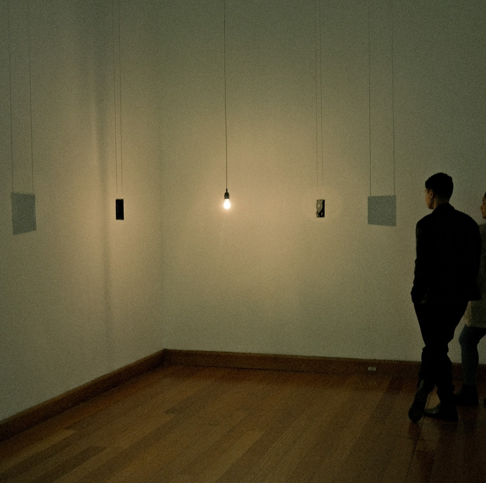
:::

::: {.project-text}
[Museo de Artes Visuales. Santiago, Chile]{.project-location}

## La memoria contándole a la luz el sonido de la lluvia (2023)

[INSTALACIÓN]{.project-subtitle}
[2 discos duros modificados, ampolleta incandescente, reproductor y amplificador de audio estéreo. Obra ganadora premio del público XVI Premio MAVI UC]{.project-materials}

"Dos discos duros son modificados para cumplir otra función. Ya no almacenan memorias, sino que según la vibración de su aguja se convierten en parlantes. El sonido que genera cada pieza es el registro de una de las últimas lluvias del 2021 en Santiago. En poca fidelidad, ambos discos duros intentan reconstruir el relato sonoro de lo que fue esa lluvia. No es posible que un aparato que no fue diseñado para reproducir sonido genere una buena experiencia sonora de la lluvia, y tampoco es posible que un aparato de registro/reproducción cualquiera se acerque mínimamente a la experiencia de la percepción. Es una lluvia torpe, que no deja charcos." — Extracto de texto de obra 
 
[Documentación completa y video](https://misaa.cc/projects/lamemoria.html)
:::
:::

<!-- FIN PROYECTO -->
<!-- FIN PROYECTO -->
<!-- FIN PROYECTO -->

<!-- INICIO PROYECTO DERECHO -->
<!-- INICIO PROYECTO DERECHO -->
<!-- INICIO PROYECTO DERECHO -->

::: {.project .project-right .caption-dark}
::: {.project-image}
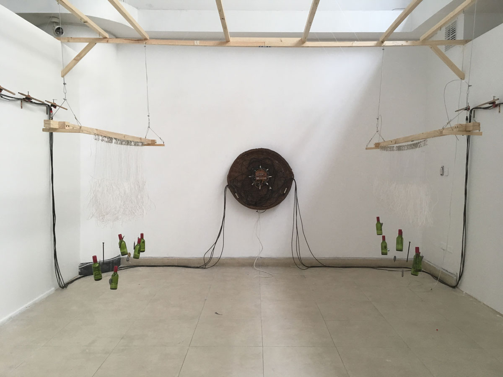
:::

::: {.project-text}
[Sala B.A.S.E. Tsonami. Valparaíso, Chile]{.project-location}

## Dispositivas de encarnación (2018)

[INSTALACIÓN + COLECTIVA 22bits + ROSA OYARCE]{.project-subtitle}
[
     Resultado de proceso de residencia. 
]{.project-materials}

El proceso de residencia se inició a partir de una investigación sobre la relación entre las mujeres y la tecnología en Valparaíso, encontrándose en la caleta Portales con Rosa Oyarce y el oficio de las encarnadoras. Es ella quien les enseña cómo se construye el espinel, artefacto que es trabajado por mujeres para la pesca artesanal.

La instalación «Dispositivas de encarnación» nos muestra este oficio y al espinel desde una dimensión sonora y visual, en un ejercicio que no sólo releva la técnica de una tecnología artesanal, sino que también dialoga de cerca con los relatos de vida y las formas de laborar de las mujeres de la caleta. 

Esta obra fue montada también el 2019 en exhibición Marea, (CENTEX, Valparaíso), y en Galería Casa Colorada (Santiago)

[Documentación completa + video](https://misaa.cc/projects/dispositivas.html)
:::
:::

<!-- FIN PROYECTO DERECHO -->
<!-- FIN PROYECTO DERECHO -->
<!-- FIN PROYECTO DERECHO -->

<!-- INICIO PROYECTO -->
<!-- INICIO PROYECTO -->
<!-- INICIO PROYECTO -->

::: {.project}
::: {.project-image}
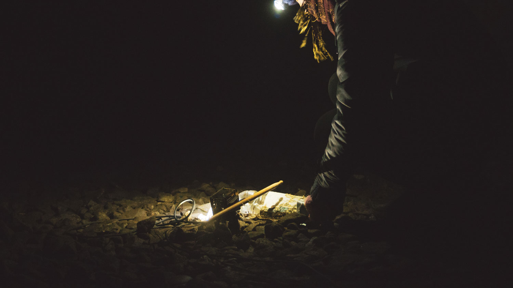
:::

::: {.project-text}
[Casa 916. Concepción, Chile]{.project-location}

## Espectral (2018)

[PERFORMANCE E INSTALACIÓN + COLECTIVA 22bits]{.project-subtitle}
[Instalación sonora cuadrafónica, resultado de performance en Túnel Punta de Parra junto a AOIR Laboratorio Sonoro. Montada en Casa 916 en Agosto de 2018.]{.project-materials}

"El proyecto Espectral: Escucha de un paisaje intervenido, es una experiencia sonora accesible ofrecida al público, donde un ambiente ajeno es traído al lugar expositivo, generando una experiencia pocas veces vivida en un espacio de exhibición. Los colectivos que desarrollan la obra, llevan y dislocan un ambiente extraño, no en su conformación de este sino a propósito de su abandono. Un túnel de más de 100 años de historia que ha quedado a las inclemencias de la naturaleza, por la salida de nuestro país de las lógicas desarrollistas, dejando un cadáver de un tiempo donde la explotación carbonífera, en las napas marinas, conectaba el litoral con el cordón ferroviario nacional, en dirección inclaudicable a su centro." Extracto de texto de Matías Allende
 
[Documentación completa y video](https://misaa.cc/projects/espectral.html)
:::
:::

<!-- FIN PROYECTO -->
<!-- FIN PROYECTO -->
<!-- FIN PROYECTO -->

<!-- INICIO PROYECTO DERECHO -->
<!-- INICIO PROYECTO DERECHO -->
<!-- INICIO PROYECTO DERECHO -->

::: {.project .project-right}
::: {.project-image}
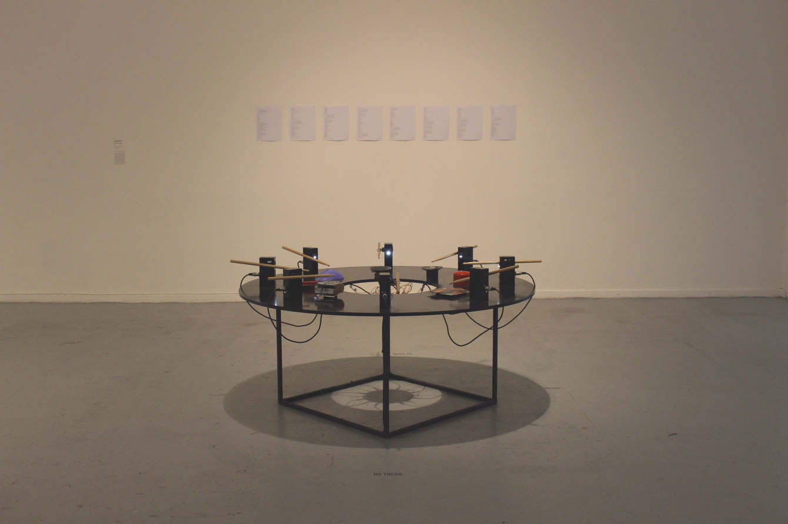
:::

::: {.project-text}
[Museo MAC Quinta Normal. Santiago, Chile]{.project-location}

## Ensayo de horizontalidad (2017)

[INSTALACIÓN SONORA]{.project-subtitle}
[8 Baquetas, 8 servomotores, Arduino, plataforma circular de 150cm de diámetro, objetos de desecho, sección de código. 3er lugar con Concurso de Arte y Tecnología en Homenaje a Matilde Pérez
]{.project-materials}

"La propuesta de la obra consiste en resignificar objetos hallados e identitarios de un sector de la ciudad, y a través de las tecnologías digitales, transformarlos en distintas voces que dialogan en torno a un centro, emulando un acto conversacional cotidiano. La carencia de rasgos de cada uno de los "percutores", nos habla de una relación comunicativa en la que las distintas voces se entienden y valoran por su sonido (su relato), más allá de sus características de sexo, edad, religión, clase, género, etc. El algoritmo creado juega dándole a cada baqueta el turno de proponer un ritmo (un tema), y las demás contestan en distintas instancias, o eligen silenciarse, emulando un diálogo cualquiera." — Extracto de texto de sala

[Documentación completa](https://misaa.cc/projects/edh.html)
:::
:::

<!-- FIN PROYECTO DERECHO -->
<!-- FIN PROYECTO DERECHO -->
<!-- FIN PROYECTO DERECHO -->

<!-- ============================================================
     DOCENCIA + RESIDENCIAS
     extraídos de https://misaa.cc/cv.md
     ============================================================ -->
::: {.cv-spread}
::: {.cv-col .cv-col-left}
## Docencia

[9 cursos · U. de Chile · UDP · UNIACC]{.cv-meta}

[Medios 2]{.cv-item-title}
[Artes Visuales, U. de Chile · 2022 – Actualidad]{.cv-item-detail}

[Electrónica en Soportes Alternativos]{.cv-item-title}
[Artes Visuales, U. de Chile · 2023 – 2025]{.cv-item-detail}

[Electrónica: del dato al objeto]{.cv-item-title}
[Artes Visuales, U. de Chile · 2023 - Actualidad]{.cv-item-detail}

[Aplic. Tecnológicas 1: Electrónica]{.cv-item-title}
[Artes Visuales, UNIACC · 2023 – 2025]{.cv-item-detail}

[Aplic. Tecnológicas 3: Objeto]{.cv-item-title}
[Artes Visuales, UNIACC · 2024 – Actualidad]{.cv-item-detail}

[Laboratorio de Arte y Electrónica]{.cv-item-title}
[Artes Visuales, UDP · 2024 – Actualidad]{.cv-item-detail}

[Taller vertical: Máquinas Electrónicas]{.cv-item-title}
[Diseño, UDP · 2025 – Actualidad]{.cv-item-detail}

[Taller vertical: Máquinas Computacionales]{.cv-item-title}
[Diseño, UDP · 2025 - Actualidad]{.cv-item-detail}

[Pensamiento Computacional]{.cv-item-title}
[Diseño, UDP · 2026 - Actualidad]{.cv-item-detail}
:::

::: {.cv-col .cv-col-right}
## Residencias

[2025 · Radicante, Liquen LAB]{.cv-item-title}
[Estrecho de Magallanes]{.cv-item-detail}

[2024 · Proyecto Error]{.cv-item-title}
[Ciudad de México]{.cv-item-detail}

[2022 · Utopías y distopías de la modernidad]{.cv-item-title}
[Isla Rey Jorge, Antártica · inv. Ingrid Wildi Merino]{.cv-item-detail}

[2021 · Soma RUMOR — II Encuentro Latinoamericano de Arte Sonora]{.cv-item-title}
[Online / Brasil]{.cv-item-detail}

[2019 · Encuentro Tsonami: Prácticas en Contextos de Crisis]{.cv-item-title}
[Valparaíso, Chile]{.cv-item-detail}

[2019 · Platohedro — La Jacquer EsCool]{.cv-item-title}
[Medellín, Colombia]{.cv-item-detail}

[2018 · Tsonami, Sala B.A.S.E.]{.cv-item-title}
[Valparaíso, Chile]{.cv-item-detail}

[2017 · Festival Tsonami]{.cv-item-title}
[Valparaíso, Chile]{.cv-item-detail}
:::
:::

<!-- FIN DOCENCIA + RESIDENCIAS -->

<!-- ============================================================
     PÁGINA DE CIERRE — contacto y enlaces
     ============================================================ -->
::: {.closing style="background-image: url('./images/tarj-pres.jpg')"}
::: {.closing-content}
## Matías Serrano Acevedo

[web: https://misaa.cc](https://misaa.cc){.closing-link}

[instagram: @misaa.cc](https://instagram.com/misaa.cc){.closing-link}

[github: misaaaaaa](https://github.com/misaaaaaa){.closing-link}

[full cv: misaa.cc/cv.html](https://misaa.cc/cv.html){.closing-link}

[mail: matias.serranoacevedo@gmail.com](mailto:matias.serranoacevedo@gmail.com){.closing-link}
:::

::: {.closing-footer}
Portafolio construido en Markdown + [paged.js](https://pagedjs.org) · Código fuente en [github.com/misaaaaaa/portfolio](https://github.com/misaaaaaa/portfolio)
:::
:::

<!-- FIN PÁGINA DE CIERRE -->