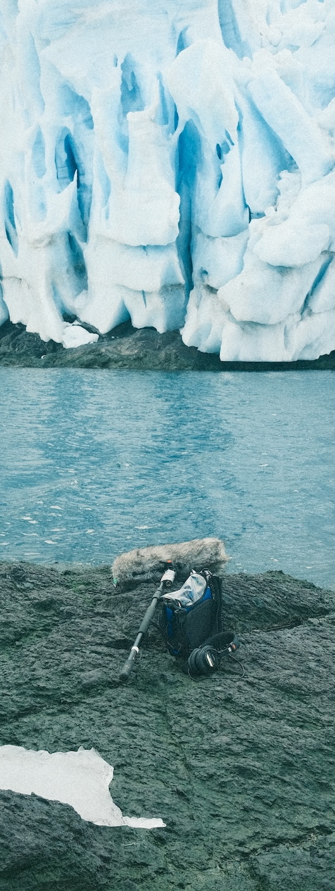
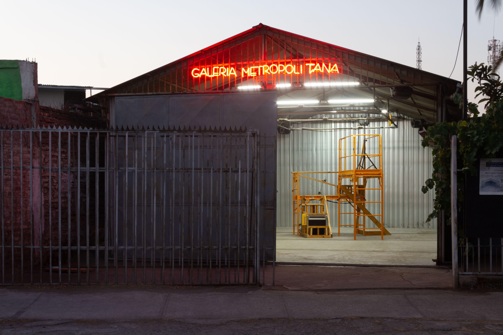
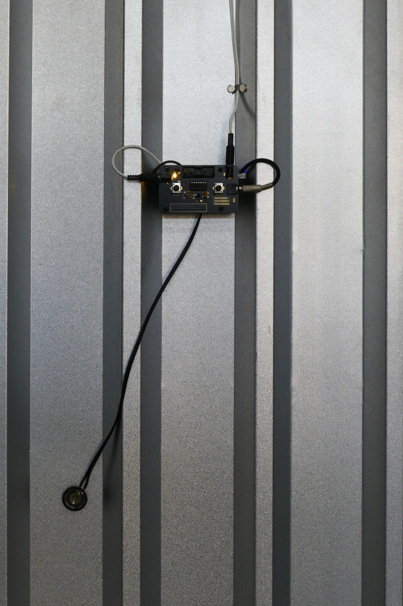

<!-- ============================================================
     PORTADA — una sola por documento.
     cover-title: título principal · artist-name: nombre · url: enlace al sitio
     ============================================================ -->
::: {.cover}

# Portafolio {.cover-title}

::: {.cover-meta}
[Matías Serrano Acevedo]{.artist-name}

[https://misaa.cc](https://misaa.cc){.url}
:::
:::

<!-- ============================================================
     BIOGRAFÍA — una sola por documento.
     Admite hasta 3 párrafos dentro de .bio-body.
     ============================================================ -->
::: {.bio}
## Biografía

::: {.bio-body}
Matías Serrano Acevedo (Santiago, 1993) es artista sonoro y medial. Magíster en Artes Mediales (2024) y Licenciado en Artes mención Sonido (2017), ambos de la Universidad de Chile. Becario desde 2026 del programa de Doctorado en Artes y Humanidades de la Universidad de Santiago de Chile. 

Académico adjunto y parte del Núcleo de Artes Sonoras del Departamento de Artes Visuales de la U. de Chile. Ha presentado su trabajo en diversos espacios, exposiciones y festivales en Chile y latinoamérica y ha publicado varios álbumes bajo el pseudónimo de “misaa”. Desde 2022 se desempeña como docente de arte, electrónica y medios en carreras de artes visuales en UNIACC, UDP y U. de Chile. Creó la Colectiva 22bits en 2015 y el sello Archivo Veintidós en 2019 junto a Bárbara Molina, a través de los cuales participaron de encuentros y festivales de arte, tecnología, sonido y diseño en Chile, México, Argentina y Colombia.
:::

:::

<!-- ============================================================
     STATEMENT — una sola por documento.
     Para omitir la imagen vertical, elimina el bloque .statement-image.
     statement-body admite varios párrafos.
     ============================================================ -->
::: {.statement}
::: {.statement-left}
## Statement

::: {.statement-image}

:::
:::

::: {.statement-body}
Mi práctica está orientada a relacionar lo sonoro y lo material, vinculando técnicas de fabricación electrónica, hackeo y ensamblaje de objetos con prácticas de escucha situada y paisajismo sonoro. De inspiración de filosofías cosmológicas, concibo al arte sonoro como una exploración de los flujos y fuerzas en la naturaleza que se manifiestan en interacciones materiales, articuladas desde la escucha.
:::
:::

<!-- ============================================================
     PROYECTO — copiar este bloque completo para cada obra.
     Usa {.project} para imagen a la izquierda (por defecto)
     Usa {.project .project-right} para imagen a la derecha
     · project-number: número de fondo (01, 02…)
     · h2: título de la obra
     · project-subtitle: Instalación / Concierto / Residencia / …
     · project-materials: circuitos, parlantes, micrófonos, pintura… (opcional)
     · párrafo de descripción
     · enlace: "[Técnica / Año — Ver proyecto →](url)"
     Alt de la imagen: aparece como crédito fotográfico superpuesto.
     ============================================================ -->
::: {.project}
::: {.project-image}

:::

::: {.project-text}
[01]{.project-number}

## Llluvia Metropolitana

[Instalación]{.project-subtitle}
[Circuitos electrónicos, micrófonos, parlantes, madera, andamio]{.project-materials}

"_Llluvia Metropolitana_ emerge alrededor de una premisa sonora que intenciona la experiencia sensible con el clima. Los artistas instalaron un sistema de grabación en los techos de zinc de la galería durante el período de lluvias invernales. Parte de este registro se nos presenta desde una altura a la que podemos acceder cuando subimos por un andamio reforzado. Se propone entonces un encuentro entre una lluvia anterior, o quizás una lluvia en pausa, que frente a la sensación atmosférica calurosa y seca, propia de enero en la ciudad, propone a lo menos una disonancia."

[Instalación Sonora junto a Rainer Krause/ 2026 — Ver en misaa.cc/ →](https://misaa.cc/projects/llluviametropolitana.html)
:::
:::

::: {.project}
::: {.project-image}

:::

::: {.project-text}
[01]{.project-number}

## Llluvia Metropolitana

[Instalación]{.project-subtitle}
[Circuitos electrónicos, micrófonos, parlantes, madera, andamio]{.project-materials}

El proyecto expositivo consiste en una sola gran obra ensamblada a partir de elementos co-construidos entre Rainer y Matías, y de ejercicios realizados de manera independiente. El eje de la muestra es el sonido de la lluvia, que fue grabada por medio de un sistema de 4 micrófonos instalados cerca del techo de zinc del espacio durante los meses de junio, julio y agosto de 2025, que registraban en un computador controlado de manera remota el sonido de cada evento de lluvia. En total, se registraron alrededor de 164 GB de audio, lo que equivale a unas 126 horas de audio a 4 canales, aproximadamente. Estos fueron editados y mezclado en una banda sonora de 4 horas, que se reproduce en la sala durante el horario de apertura de la galería. 

[Instalación Sonora junto a Rainer Krause/ 2026 — Ver en misaa.cc/ →](https://misaa.cc/projects/llluviametropolitana.html)
:::
:::

::: {.project .project-right}
::: {.project-image}

:::

::: {.project-text}
[02]{.project-number}

## Título del Proyecto Dos

[Concierto]{.project-subtitle}
[Materiales del proyecto]{.project-materials}

Descripción del proyecto. Aquí va un texto que explica el concepto, el proceso y los
materiales utilizados. Puede incluir el año, el contexto de exhibición y otras notas
relevantes sobre la obra.

[Instalación / 2023 — Ver proyecto →](https://example.com)
:::
:::

::: {.project}
::: {.project-image}

:::

::: {.project-text}
[03]{.project-number}

## Título del Proyecto Tres

[Residencia]{.project-subtitle}
[Materiales del proyecto]{.project-materials}

Descripción del proyecto. Aquí va un texto que explica el concepto, el proceso y los
materiales utilizados. Puede incluir el año, el contexto de exhibición y otras notas
relevantes sobre la obra.

[Video / 2024 — Ver proyecto →](https://example.com)
:::
:::

<!-- ============================================================
     PÁGINA IMAGEN COMPLETA — copiar este bloque para cada imagen a pantalla completa.
     El texto del alt ![...] aparece como crédito fotográfico
     superpuesto en la esquina inferior derecha.
     ============================================================ -->
::: {.fullpage}

:::
